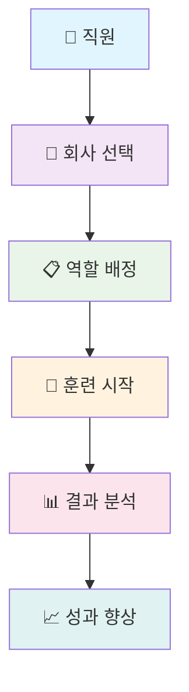
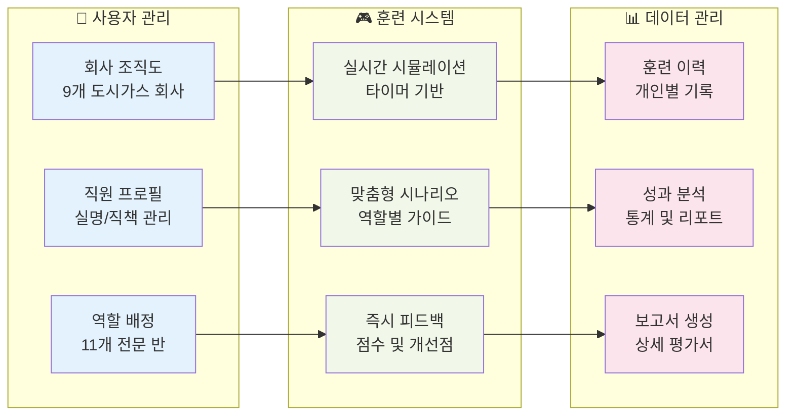
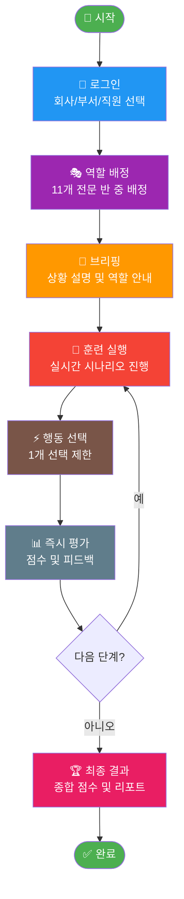
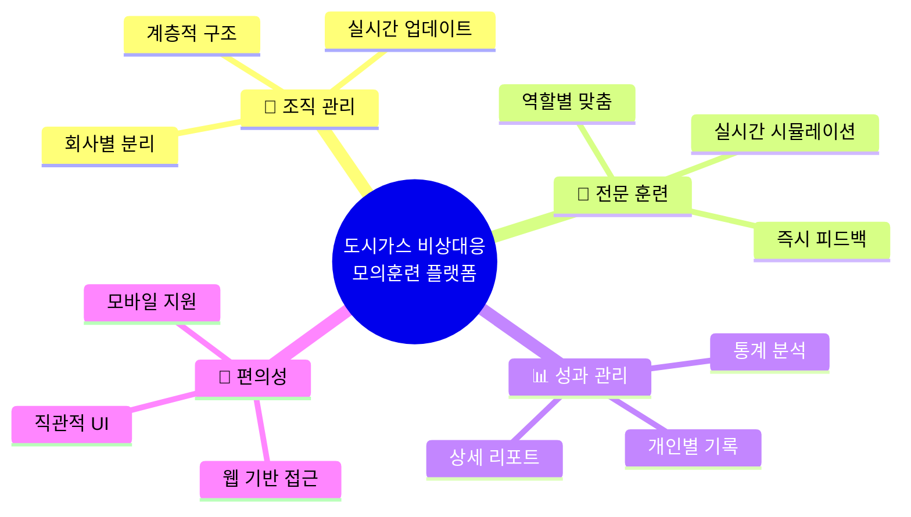
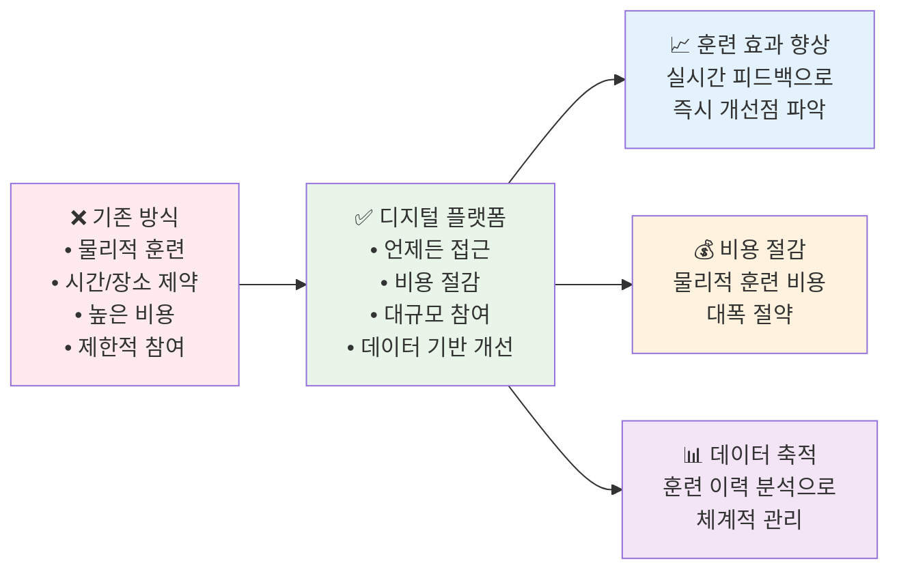
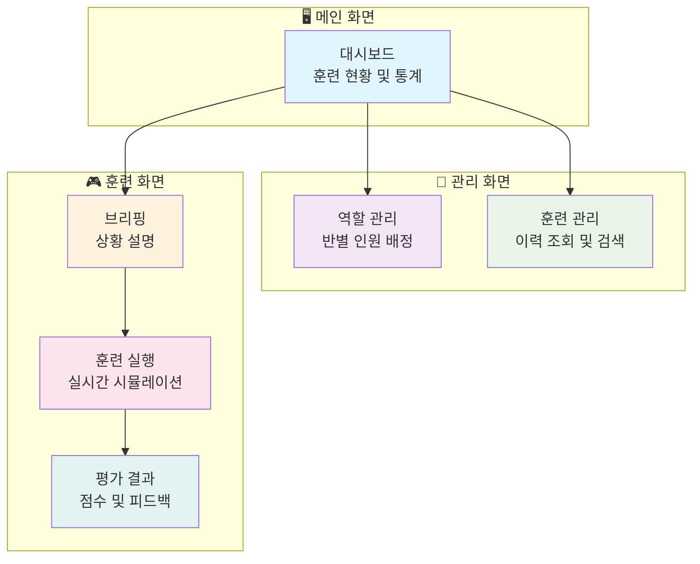

# 도시가스 비상대응 모의훈련 플랫폼 - 간단 소개

## 🏢 플랫폼 개요

## 🎯 핵심 기능

## 🚀 훈련 프로세스

## 💡 주요 특징

## 📈 기대 효과

## 🎨 플랫폼 화면 구성

---

## 🌟 **도시가스 비상대응 모의훈련 플랫폼**

**언제든지, 어디서든, 안전하고 체계적인 비상상황 대응 훈련을 제공합니다!**

- 🏢 **9개 도시가스 회사** 지원
- 🎭 **11개 전문 반** 역할 시스템  
- 🎯 **실시간 시뮬레이션** 훈련
- 📊 **데이터 기반** 성과 관리
- 💰 **비용 절감** 및 **효율성 향상**
