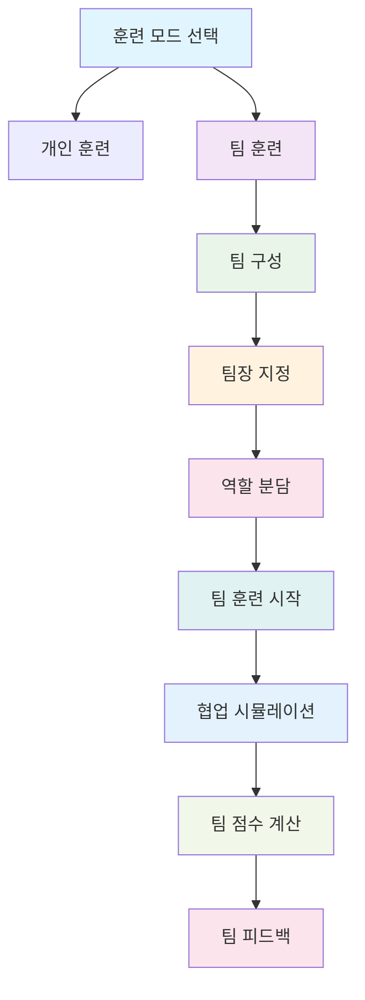
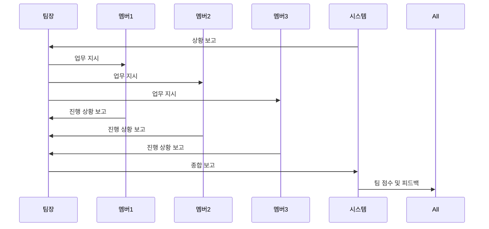
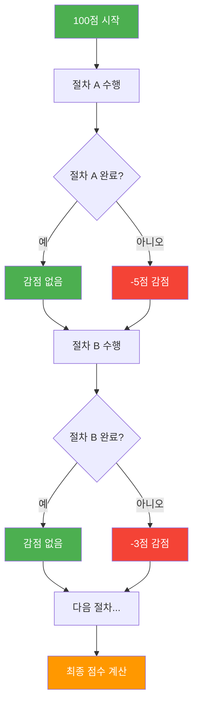

# 팀 단위 훈련 기능 제안서

## 🎯 팀 훈련 모드 개요



## 🏢 팀 구성 방식

### 1. **자동 팀 구성**
- 같은 회사/부서/팀 내에서 자동 매칭
- 각 팀당 3-5명 구성
- 역할별 균형 배치

### 2. **수동 팀 구성**
- 관리자가 직접 팀 구성
- 특정 프로젝트나 상황에 맞는 팀 구성
- 팀장 지정 및 역할 분담

## 🎮 팀 훈련 시나리오

### 1. **협업 시나리오**


### 2. **역할별 협업**
- **팀장**: 전체 지휘 및 의사결정
- **현장팀**: 실제 작업 수행
- **관제팀**: 상황 모니터링 및 보고
- **안전팀**: 안전 확보 및 점검

## 📊 절차별 체크리스트 평가 시스템

### 1. **절차 체크리스트 방식**
- A~Z 절차가 있다고 가정
- 각 절차별 필수 행동 정의
- 빼먹은 절차마다 감점 적용

### 2. **감점 시스템 예시**


### 3. **절차별 중요도 차등 감점**
- **핵심 절차**: -10점 (안전 확인, 신고 등)
- **중요 절차**: -5점 (보고, 연락 등)
- **일반 절차**: -3점 (문서 작성, 정리 등)
- **선택 절차**: -1점 (부가적 행동)

## 🚀 구현 단계

### Phase 1: 기본 팀 구성
- 팀 생성 및 관리 기능
- 팀원 초대 및 승인
- 팀장 지정

### Phase 2: 팀 훈련 시나리오
- 협업 시나리오 개발
- 실시간 팀 채팅
- 팀 대시보드

### Phase 3: 고급 기능
- 팀 간 경쟁 모드
- 팀 리더보드
- 팀 성과 분석

## 💡 기대 효과

### 1. **실제 업무 환경 반영**
- 팀워크 향상
- 의사소통 능력 개발
- 리더십 역량 강화

### 2. **훈련 효과 증대**
- 현실적인 시나리오
- 상호 학습 효과
- 동기부여 증가

### 3. **조직 문화 개선**
- 팀 결속력 강화
- 협업 문화 조성
- 혁신적 사고 촉진

## 🎯 절차별 체크리스트 예시

### 시나리오: 가스 누출 사고 대응 절차

#### A. 초기 대응 (핵심 절차)
- [ ] A1. 안전장비 착용 (-10점)
- [ ] A2. 현장 접근 금지 설정 (-10점)
- [ ] A3. 119 신고 (-10점)
- [ ] A4. 주변 대피 지시 (-10점)

#### B. 상황 파악 (중요 절차)
- [ ] B1. 가스 누출 지점 확인 (-5점)
- [ ] B2. 영향 범위 조사 (-5점)
- [ ] B3. 위험도 평가 (-5점)
- [ ] B4. 상위 보고 (-5점)

#### C. 대응 조치 (일반 절차)
- [ ] C1. 밸브 차단 (-3점)
- [ ] C2. 환기 조치 (-3점)
- [ ] C3. 현장 통제 (-3점)
- [ ] C4. 복구 계획 수립 (-3점)

#### D. 사후 처리 (선택 절차)
- [ ] D1. 사고 보고서 작성 (-1점)
- [ ] D2. 재발 방지 대책 (-1점)
- [ ] D3. 교육 계획 수립 (-1점)

### 점수 계산 예시
```
100점 (시작)
- A1 미수행: -10점 = 90점
- B2 미수행: -5점 = 85점  
- C3 미수행: -3점 = 82점
- D1 미수행: -1점 = 81점

최종 점수: 81점
```

---

## 🌟 **팀 단위 훈련의 장점**

- 🤝 **실제 업무 환경** 반영
- 📈 **훈련 효과** 대폭 향상  
- 🏆 **팀워크** 및 **협업 능력** 개발
- 💰 **비용 효율성** 극대화
- 📊 **데이터 기반** 팀 성과 관리
