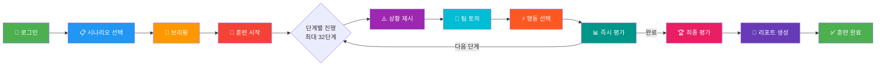
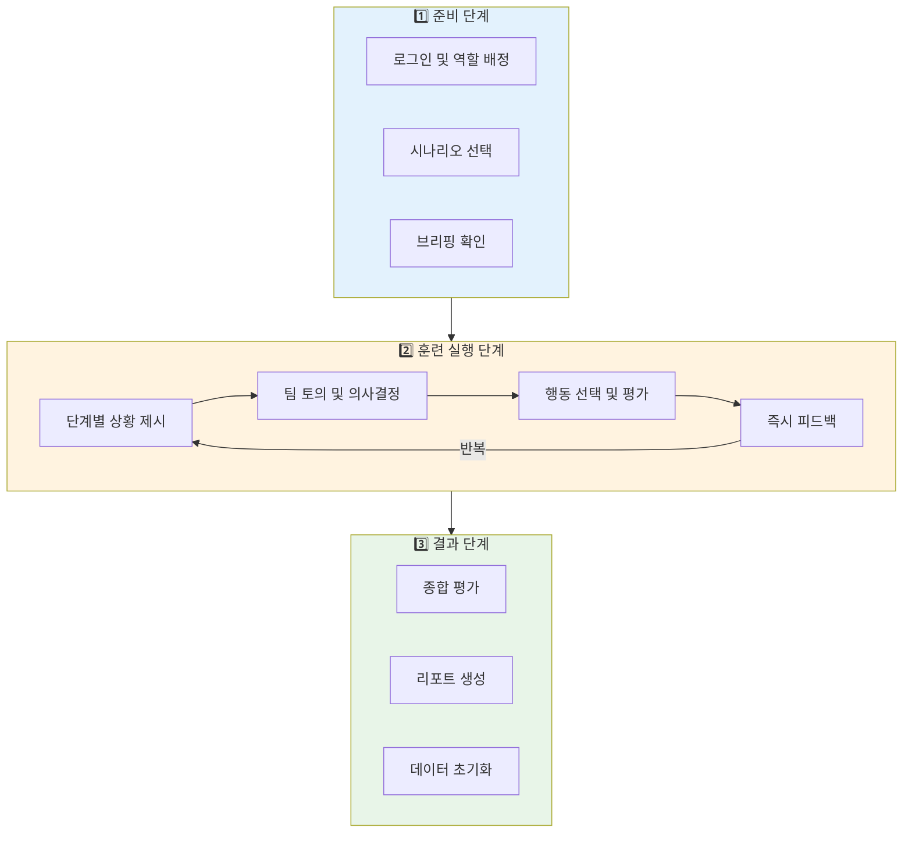

# 플랫폼 훈련 프로세스 간단 모식도 (PPT용)

## 📊 PPT용 간단 프로세스 플로우



## 🎯 3단계 요약 프로세스



## 📋 텍스트 버전 (PPT 본문용)

### **플랫폼 훈련 프로세스**

#### **1단계: 준비 단계**
- 👤 로그인 및 회사/부서 선택
- 👥 역할 배정 (11개 전문반 중 선택)
- 📋 시나리오 선택 (3가지 시나리오 중 선택)
- 📖 브리핑 (상황 설명 및 역할 안내)

#### **2단계: 훈련 실행 단계** (핵심 반복 과정)
- ⏰ 타이머 시작 (20-30분 제한)
- 📝 **단계별 진행** (최대 32단계)
  1. ⚠️ **상황 제시**: 현재 단계의 비상상황 정보 표시
  2. 👥 **팀 토의**: 선택지 논의 및 의사결정
  3. ⚡ **행동 선택**: 객관식 또는 서술형 답변 선택
  4. 📊 **즉시 평가**: 선택 정확도 및 소요 시간 평가
  5. 💬 **피드백 표시**: 개선점 및 강점 피드백
  6. ➡️ **다음 단계 이동**: 다음 단계로 진행 (1-5 반복)

#### **3단계: 결과 단계**
- 🏆 **최종 평가**: 종합 점수 산출 및 등급 부여
- 📄 **리포트 생성**: 상세 평가서 작성 (HTML 형식)
- 📥 **리포트 다운로드**: 결과 저장 및 공유
- 🗑️ **데이터 초기화**: 다음 훈련을 위한 데이터 정리

---

## 🔄 핵심 반복 루프 상세

```
┌─────────────────────────────────────────┐
│         훈련 실행 단계 (반복)             │
├─────────────────────────────────────────┤
│                                         │
│  1. 상황 제시 (⚠️)                       │
│     └─ 실시간 상황 정보, 선택지 제공      │
│                                         │
│  2. 팀 토의 (👥)                         │
│     └─ 선택지 논의, 의사결정            │
│                                         │
│  3. 행동 선택 (⚡)                        │
│     └─ 객관식 선택 또는 서술형 답변       │
│                                         │
│  4. 즉시 평가 (📊)                       │
│     └─ 점수 계산 및 피드백 제공          │
│                                         │
│  5. 다음 단계 확인                       │
│     ├─ 진행 중 → 1단계로 이동            │
│     └─ 완료 → 최종 평가로 이동           │
│                                         │
└─────────────────────────────────────────┘
```

---

## ⏱️ 시간 관리 프로세스

```
훈련 시작
    ↓
타이머 활성화 (20-30분)
    ↓
[반복: 단계별 진행]
    ↓
시간 체크
    ├─ 시간 남음 → 계속 진행
    ├─ 시간 부족 → 경고 표시
    └─ 시간 초과 → 강제 완료
    ↓
최종 평가
```

---

## 📊 평가 체계 간단도

```
행동 선택
    ↓
┌─────────────────┐
│   평가 요소      │
├─────────────────┤
│ • 정확도        │
│ • 소요 시간      │
│ • 절차 준수      │
│ • 팀 협업       │
└─────────────────┘
    ↓
점수 계산 (0-100점)
    ↓
피드백 생성
    ↓
종합 평가
```

---

## 🎯 역할별 R&R 기반 훈련

```
역할 배정
    ├─ 관제운영반 → 관제센터 통보
    ├─ 현장출동반 → 현장 출동 및 조치
    └─ 안전관리반 → 안전 확보 및 대피
         ↓
역할별 행동 가이드 제공
         ↓
역할에 맞는 행동 선택
         ↓
역할별 평가 및 피드백
```

---

## 💡 주요 특징 요약

| 특징 | 설명 |
|------|------|
| **실시간 피드백** | 각 단계마다 즉시 평가 및 피드백 제공 |
| **시간 제한 관리** | 제한 시간 내 완료 여부 모니터링 |
| **팀 토의 기반** | 팀 단위로 의사결정 및 논의 가능 |
| **역할별 맞춤** | 11개 전문반별 맞춤형 행동 가이드 |
| **정량적 평가** | 객관적 점수 산출 및 등급 부여 |
| **데이터 추적** | 모든 훈련 과정 데이터 수집 및 분석 |

