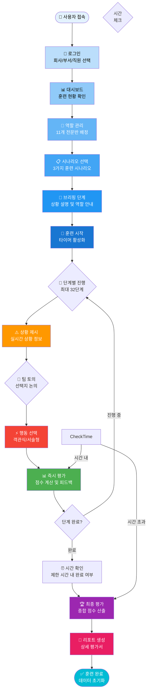
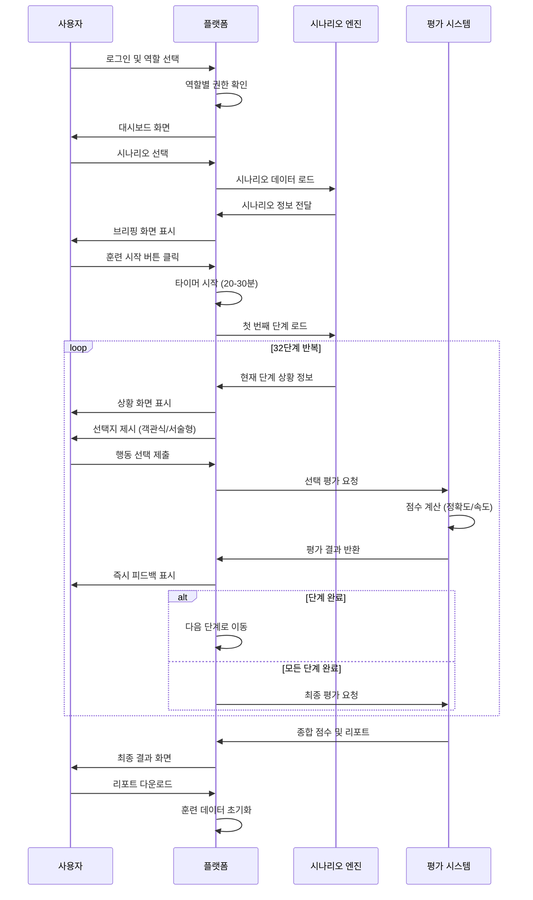
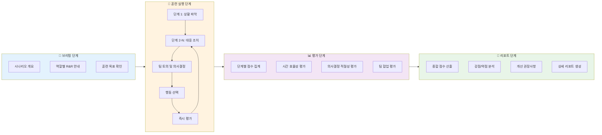
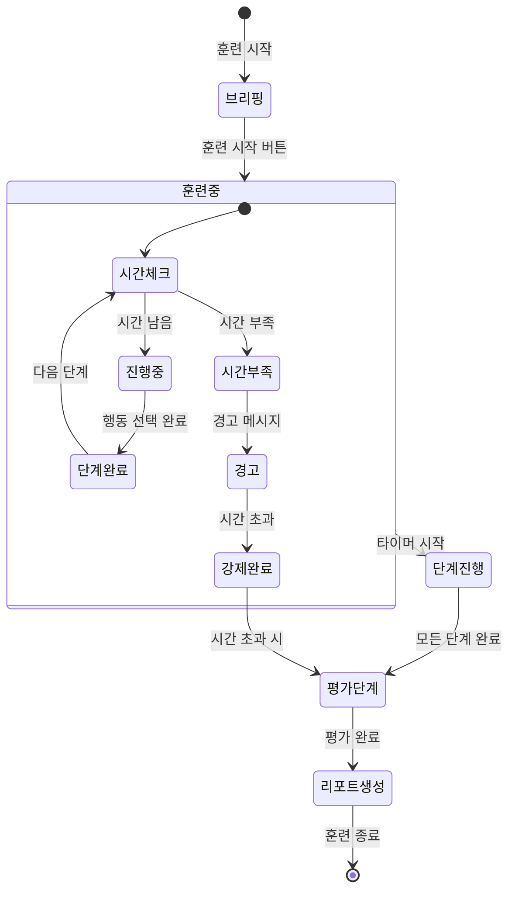
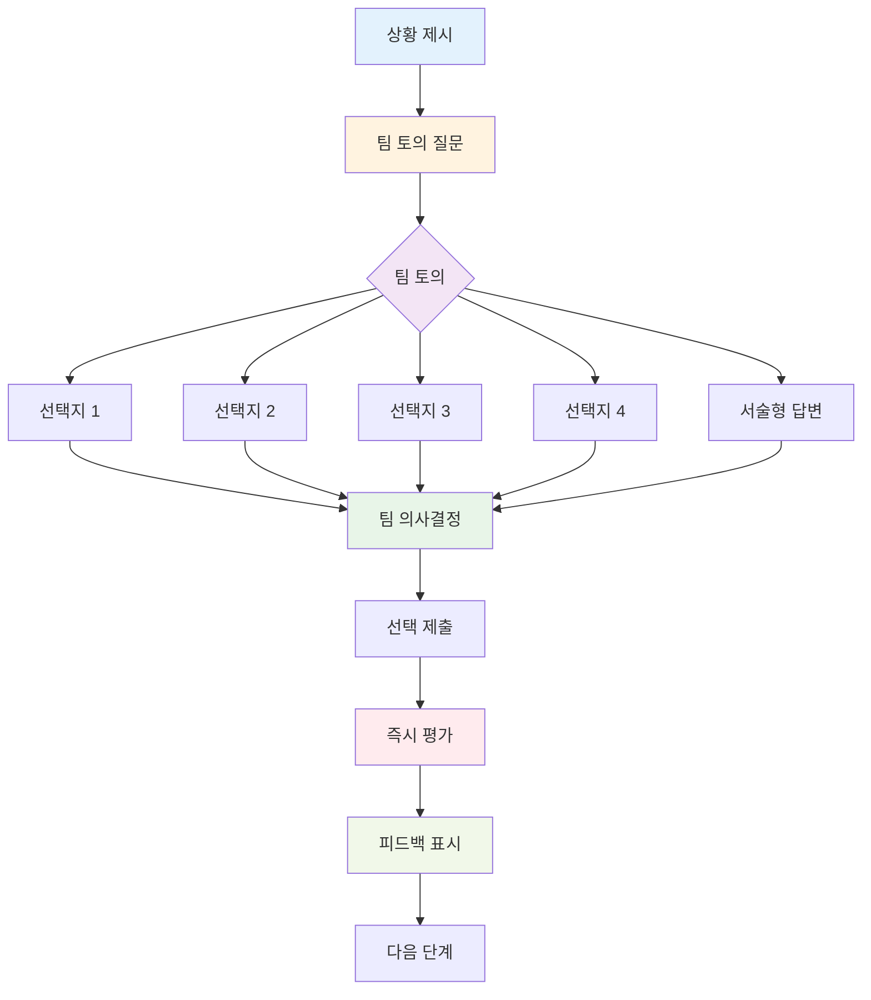
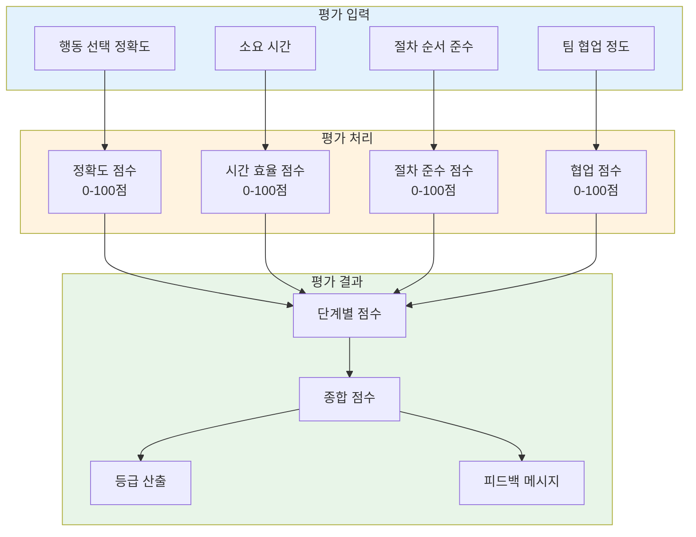
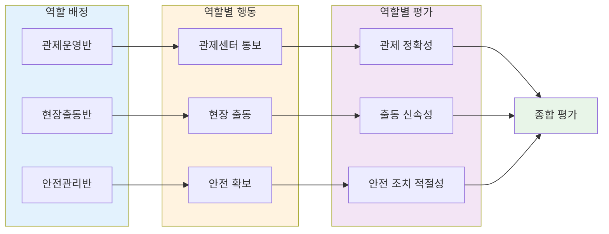
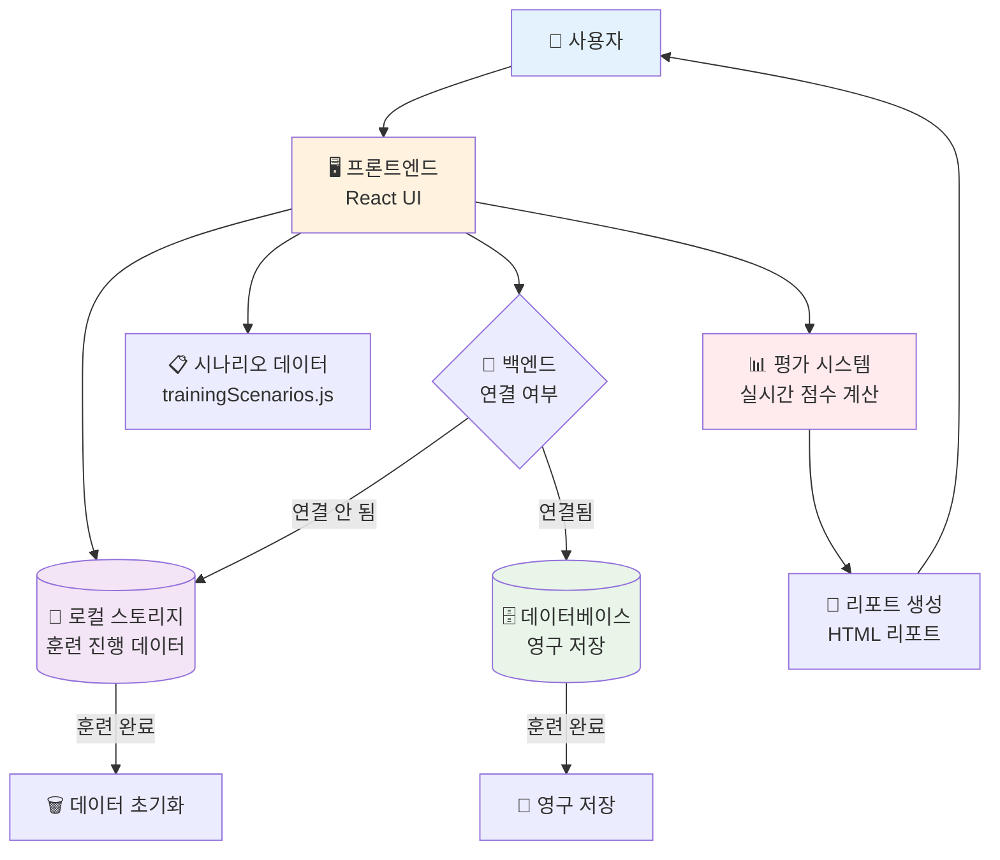

# 플랫폼 훈련 프로세스 모식도

## 📊 전체 훈련 프로세스 플로우차트

## 🎯 상세 훈련 실행 프로세스

## 🔄 훈련 단계별 상세 프로세스

## ⏱️ 시간 제한 관리 프로세스

## 👥 팀 토의 및 의사결정 프로세스

## 📈 평가 체계 프로세스

## 🎯 역할별 R&R 기반 훈련 프로세스

## 🔄 데이터 흐름도

---

## 📋 프로세스 요약

### **1단계: 준비 단계**
- 로그인 및 회사/부서 선택
- 역할 배정 (11개 전문반)
- 시나리오 선택 (3가지 중 선택)

### **2단계: 브리핑 단계**
- 시나리오 상황 설명
- 역할별 R&R 안내
- 훈련 목표 확인

### **3단계: 훈련 실행 단계** (핵심)
- 타이머 시작 (20-30분)
- 단계별 상황 제시 (최대 32단계)
- 팀 토의 및 선택지 논의
- 행동 선택 (객관식/서술형)
- 즉시 평가 및 피드백

### **4단계: 평가 단계**
- 단계별 점수 집계
- 시간 효율성 평가
- 의사결정 적절성 평가
- 종합 점수 산출

### **5단계: 리포트 단계**
- 강점/약점 분석
- 개선 권장사항
- 상세 리포트 생성 및 다운로드
- 훈련 데이터 초기화

---

## 🎯 주요 특징

1. **실시간 피드백**: 각 단계마다 즉시 평가 및 피드백 제공
2. **시간 제한 관리**: 제한 시간 내 완료 여부 모니터링
3. **팀 토의 기반**: 팀 단위로 의사결정 및 논의 가능
4. **역할별 맞춤**: 11개 전문반별 맞춤형 행동 가이드
5. **정량적 평가**: 객관적 점수 산출 및 등급 부여
6. **데이터 추적**: 모든 훈련 과정 데이터 수집 및 분석

